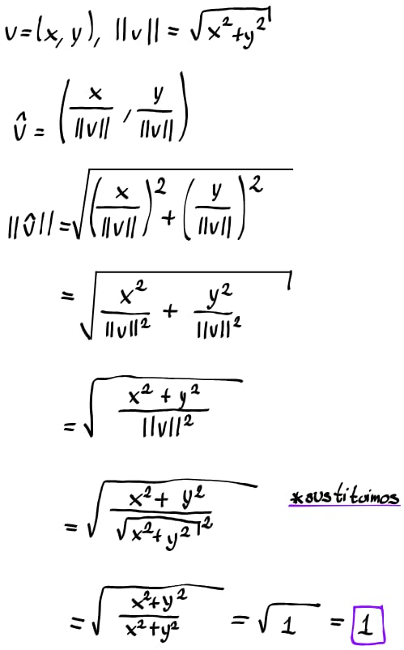
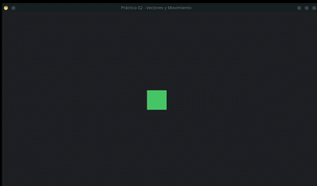
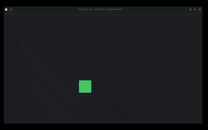

# Fundamentos y Arquitectura de Motores de Videojuegos 2D en C++
### Luis Mario Solares Ramos 321057110
### Username Github: lmSolares

#### Error diagonal
El error pasa cuando presionamos dos teclas al mismo tiempo , al movernos en diagonal se crea un vector *v = (1,-1)*,
si calculamos su longitud: 

Lo cual es mayor a 1, por lo que cuando multipliquemos por la velocidad *300px/s* entonces se moveria *424.26*, cuando
el límite es *300*. Entonces la solución es normalizar el vector, haciendo esto se mantiene su dirección, pero la 
longitud se mantiene en *1*. La demostración es la siguiente: 



#### Ejecución 
Se muestra la ejecución del programa



#### Commits
Para ver los commmits que se hicieron se puede ver el archivo *log.txt* donde se encuentra la salida del comando

```bash
git log
```

#### Ejercicio opcional
Hice el ejercicio opcional de confinar al personaje en la ventana, mi lógica fue que dentro de la función *PhysicsUpdate*
(donde se actualiza la posición) podemos verificar si al calcular la nueva posición está queda fuera de los límites
que establecemos, entonces la coordenada donde se saldría no la actualizamos y la mantenemos en el límite, i.e si al 
calcular la nueva posición en *x* es menor a *0*, entonces *x* se mantendrá en *0*. Pasa lo mismo en los cuatro límites
que se establecieron. Se adjunta la demostración del resultado: 


