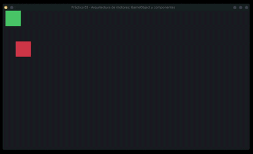

# Reporte Práctica 03 - Arquitectura de Motores: GameObject y Componentes

**Nombre completo:** Luis Mario Solares Ramos
**Usuario de GitHub:** lmSolares

## Justificación

Usar `std::vector<std::unique_ptr<Component>>` es importante para mantener el polimorfismo y la integridad de los datos en memoria, si usaramos algo como `std::vector<Component>`, el compilador reservaría bloques de memoria con el tamaño exacto de la clase `Component`. Al intentar agregar una clase más grande, como `TransformComponent`, se haria una copia por valor que descartaría todos los atributos adicionales. Además, de hacer que las llamadas a métodos virtuales se hagan estáticamente en la clase principal, ignorando las implementaciones específicas.

Al almacenar punteros inteligentes (`std::unique_ptr`), el vector guarda referencias de tamaño fijo, evitando recortar los objetos. Ademas, `std::unique_ptr` garantiza la liberación automática de memoria (RAII), destruyendo en cascada los componentes cuando el `GameObject` es destruido.

`dynamic_cast` en `GetComponent<T>()`, en el diseño propuesto, los componentes frecuentemente necesitan interactuar entre sí, pero dado que `GameObject` almacena todos sus componentes como punteros genéricos a la clase (`Component`), es necesario recuperar su tipo original.

El rol de `dynamic_cast` en el método `GetComponent<T>()` es utilizar la información de tipos en tiempo de ejecución (RTTI) de C++ para comprobar si el puntero base en memoria es realmente compatible con el tipo solicitado `T`. Si la entidad tiene ese componente, devuelve un puntero tipado de la clase, permitiendo la comunicación entre componentes; si falla, devuelve `nullptr`.

## Evidencias

**GIF de la ejecución:**

**Enlace a los commits en GitHub:**
https://github.com/lmSolares/practica02-motor/commits/main/?since=2026-09-17&until=2026-09-17
