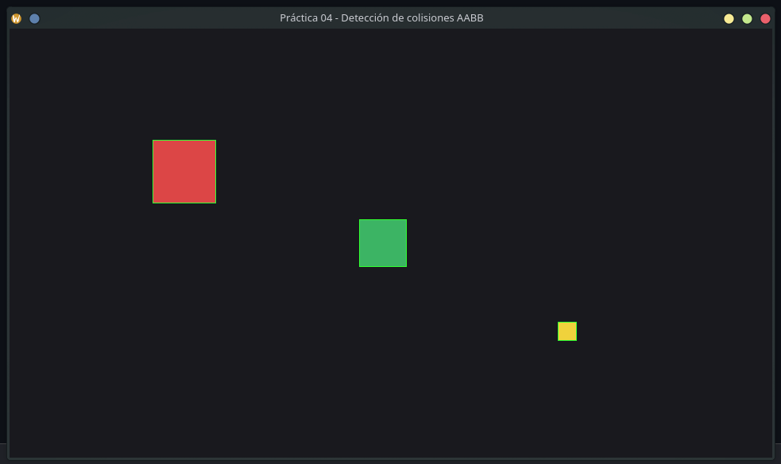
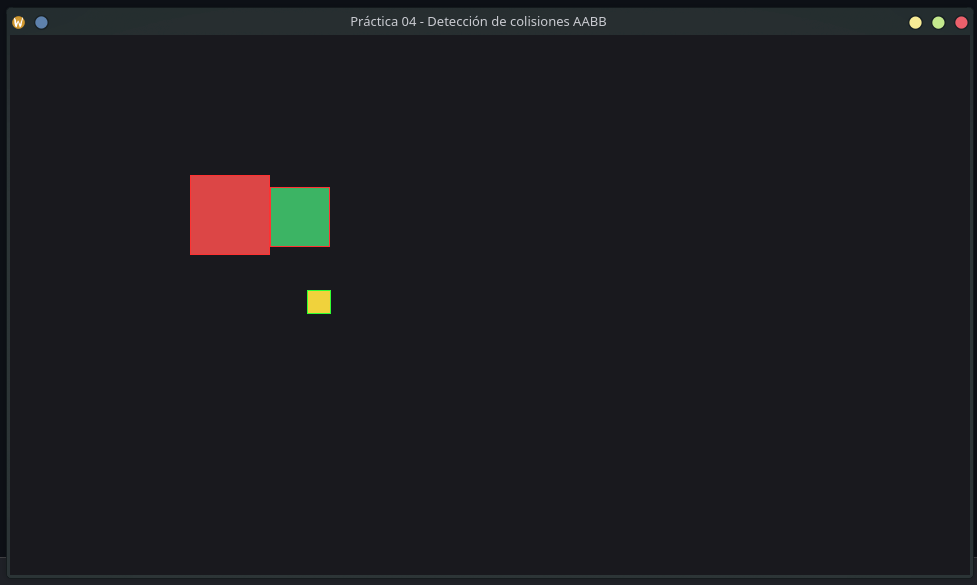
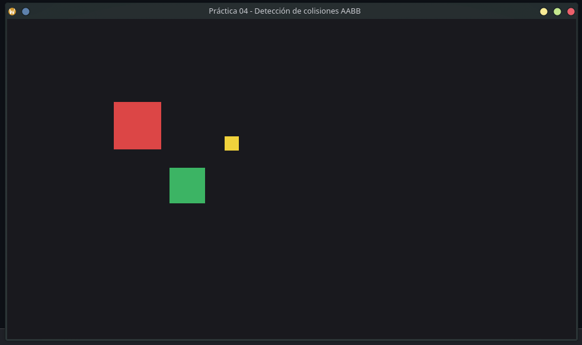

# Reporte Práctica 04 - Arquitectura de Motores: Detección de colisiones AABB

**Nombre completo:** Luis Mario Solares Ramos
**Usuario de GitHub:** lmSolares
**Tag de entrega:** `v0.4`
**Enlace al Tag:** https://github.com/lmSolares/practica02-motor/releases/tag/v0.4

## 1. Justificación matemática (De Morgan y SAT)

Para deducir la intersección AABB, primero definimos cuándo es físicamente imposible que dos rectángulos choquen: cuando existe una separación en el eje X o en el eje Y. Al negar lógicamente esta proposición de separación utilizando las Leyes de De Morgan, las disyunciones se convierten en conjunciones. Por lo tanto, determinamos que una colisión ocurre si y solo si se cumplen simultáneamente cuatro desigualdades estrictas que garantizan el solapamiento en ambos ejes.

## 2. Espacio Local vs. Espacio del Mundo

Es indispensable contar con un `offset` local en el `ColliderComponent` porque, en la práctica, la caja de colisión casi nunca coincide exactamente con la posición y tamaño de lo visible . Para realizar la detección, el motor calcula los límites globales sumando las coordenadas absolutas del `TransformComponent` con el `offset` local, y determina el tamaño final multiplicando la caja base por el factor de escala de la entidad.

## 3. Complejidad Algorítmica

Un doble bucle para verificar colisiones genera un problema de complejidad algorítmica $O(N^2)$, duplicando comprobaciones entre la misma pareja de entidades y auto-colisiones . Al utilizar una iteración triangular donde el segundo bucle inicia en $j = i + 1$, garantizamos pares únicos, reduciendo el total de operaciones a $\frac{N(N-1)}{2}$, lo cual optimiza el rendimiento.

## 4. Evidencias de Ejecución

### Escena en reposo con Debug Draw activo (cajas en verde)

### Momento exacto de un impacto (cajas en rojo)

### Escena normal con el Debug Draw apagado (tecla F1)

